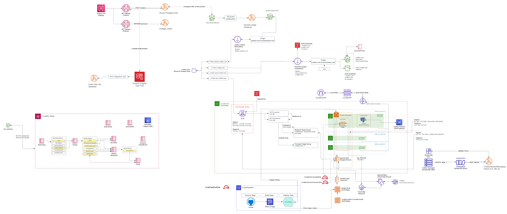
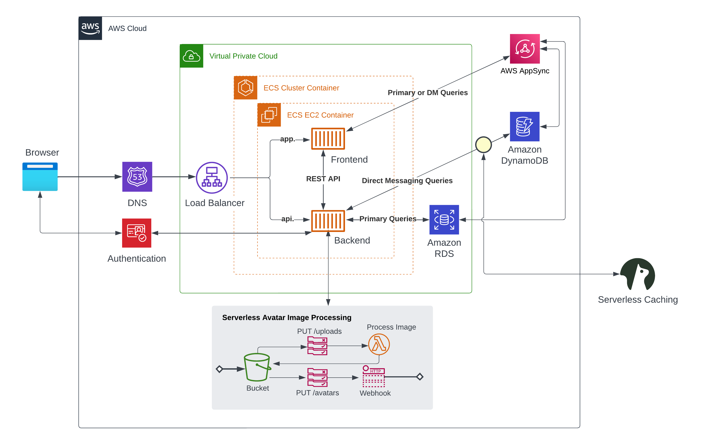
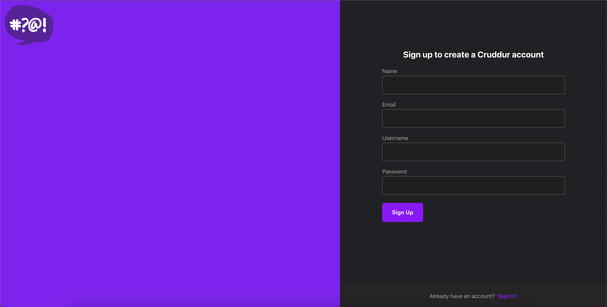
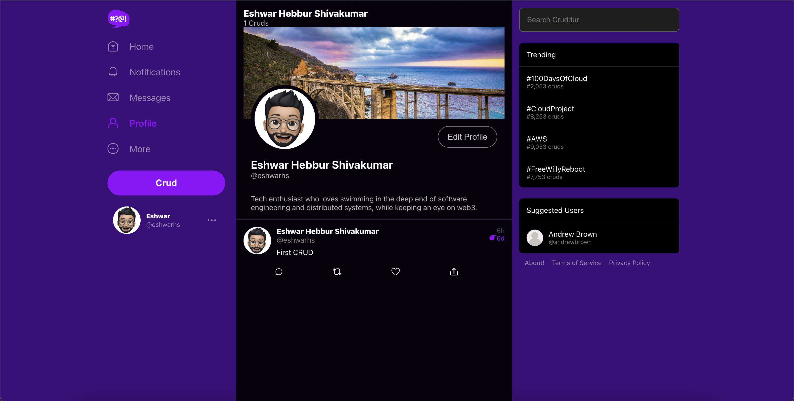

# Cruddur

Cruddur is an online social media and social networking service. It is a microblogging platform with expiring posts that emphasizes privacy and the present moment. It allows users to post updates and thoughts known as "cruds", that automatically expire after a period of time, ensuring that personal information and conversations stay relevant and in the moment. Registered users can "re-crud", like and direct message other registered users.

---

### Architecture Diagram

---

### Logial Design - v1

---

### Screenshots

#### Sign Up Page

#### Home Page

#### Profile Page

#### Messages Page

#### Notifications Page

