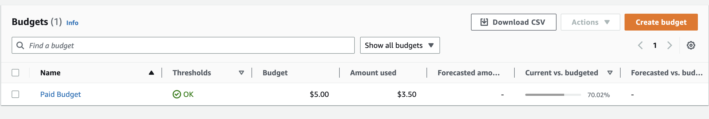

# Week 0 — Billing and Architecture

## Required Homework/Tasks

### Install and Verify AWS CLI 

- Installed AWS CLI on GitPod. Updated .gitpod.yml to automate installation on AWS CLI.
- Generated AWS Access keys and setup the keys in Gitpod enviroment variables.

### Create and Setup AWS account

- Enable MFA on Root account. Used Google Authenticator to add additional layer of security when logging in
- Created IAM user and generated access keys to access it from CLI.

### Create a Budget

- Created my own Budget for $5 because I cannot afford any kind of spend beyond the AWS credits. Created the Budget using AWS Console.
- Did not create a second Budget because I was concerned of budget spending going over the 2 budget free limit.

### Create a Billing Alarm

- Created a Billing alarm to notify via email when the spending exceeds $10.

### Recreate Conceptual Diagram
[LucidChart Link for Conceptual Diagram](https://lucid.app/lucidchart/b502b616-fac9-499e-83a4-41740ff720b9/edit?viewport_loc=-312%2C-109%2C2219%2C1123%2C0_0&invitationId=inv_00755f14-a806-463c-b52e-1b788ae39689)

### Recreate Logical Architectural Design
[LucidChart Link for Logical Diagram](https://lucid.app/lucidchart/4bff9e2d-7f29-40e3-93d5-0cfa7d97e87e/edit?viewport_loc=-227%2C-116%2C2154%2C1090%2C0_0&invitationId=inv_7b5c2704-0fe5-4b88-9b98-31f53699f0a4)

