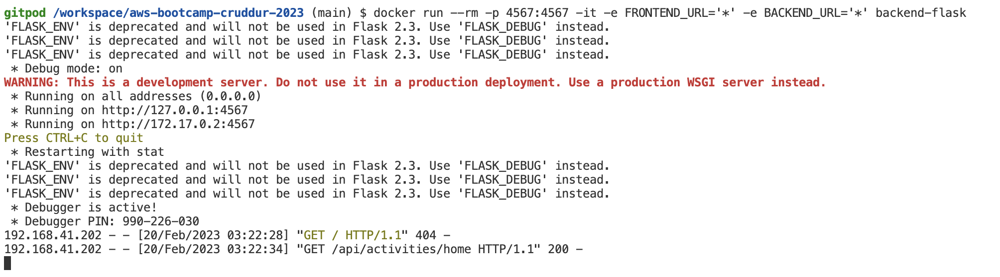
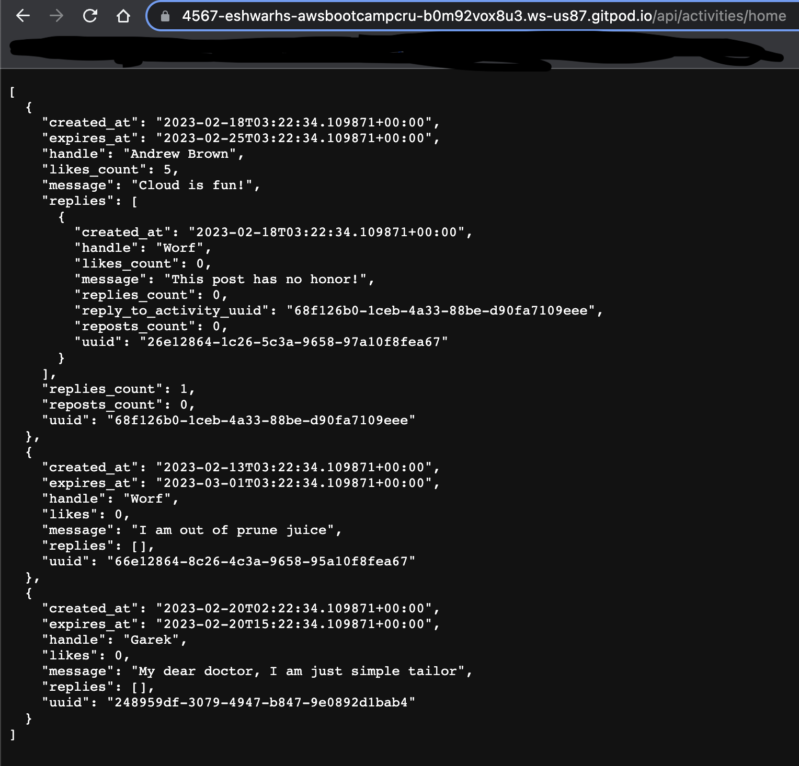
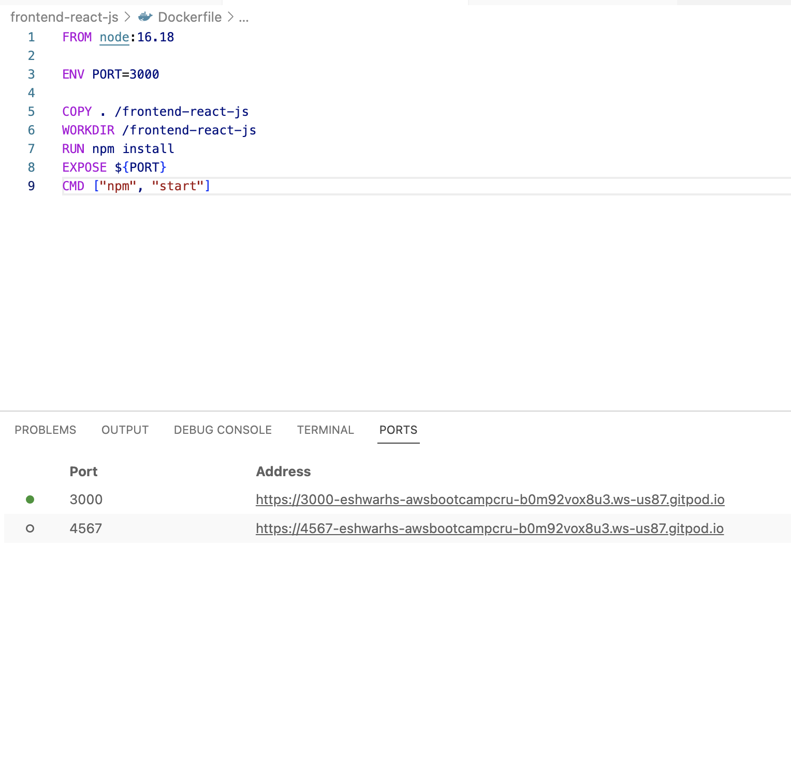
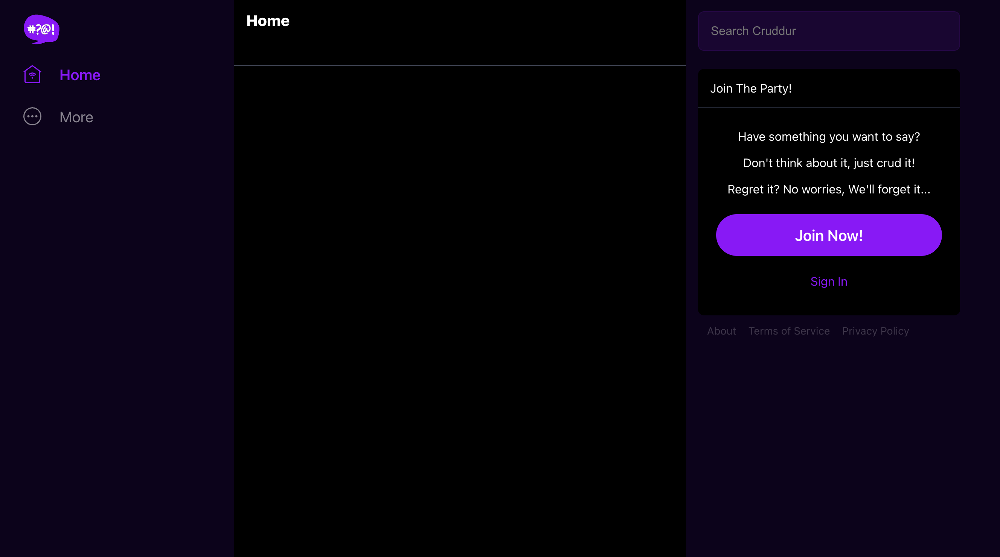
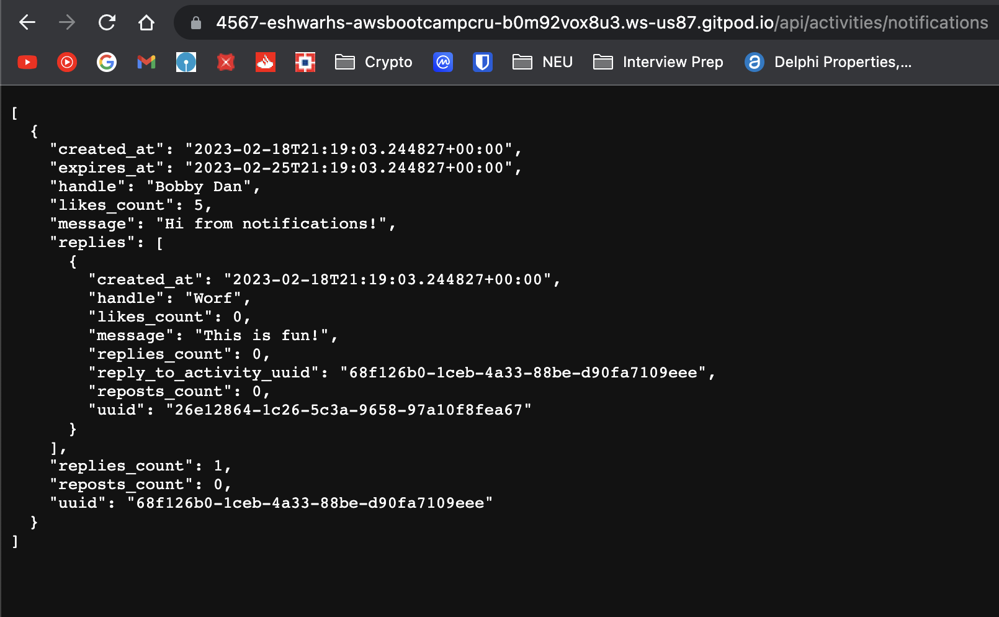
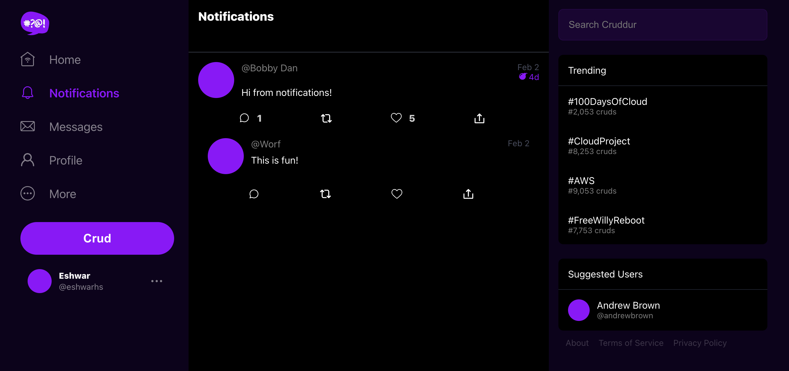
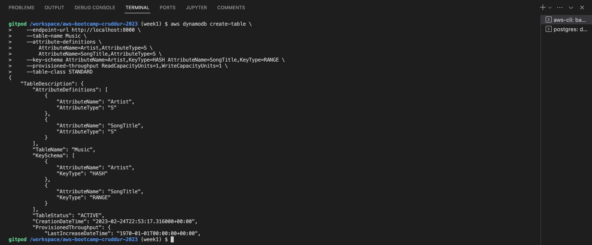
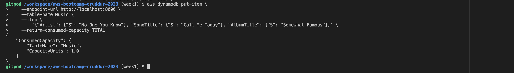
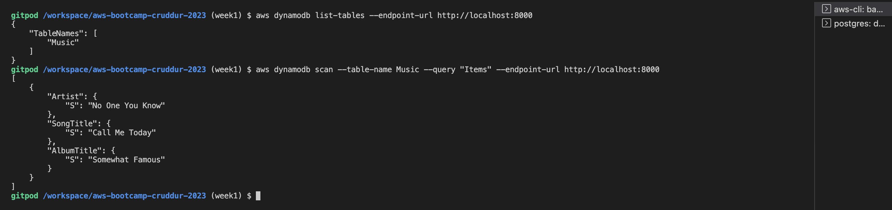
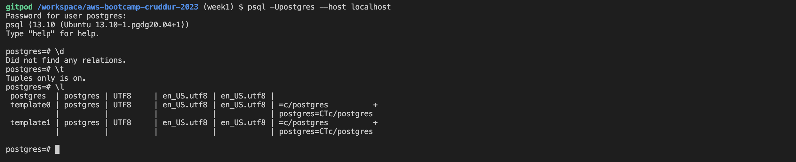

# Week 1 — App Containerization

## Required Homework/Tasks

### Create Docker containers for backend and frontend services

#### Create docker container for  for backend-flask
- Create Dockerfile for backend-flask
[backend-flask Dockerfile]((../backend-flask/Dockerfile))

- Build Docker image for backend-flask


- Run Docker container for backend-flask


#### Create docker container for  for frontend-react-js
- Create Dockerfile for frontend-react-js
[backend-flask Dockerfile]((../frontend-react-js/Dockerfile))

- Build Docker image for frontend-react-js


- Run Docker container for frontend-react-js


### Create docker-compose to run backend and frontend simultaneously
- Create `docker-compose.yml` for both services together
[docker-compose.yml]((../docker-compose.yml))

- Run docker-compose-up to run spin up both the containers
[Backend and Frontend endpoints](assets/week1/docker-compose-up.png)
[Website with mock data](assets/week1/docker-compose-output.png)

### Create Notification feature 
- Implemented a backend flask API endpoint to return notification activities for a particular user


- Integrated backend API to fetch notifications and display it on the frontend web app


- Documented the Notification API on openAPI spec

I have added a new endoint for notifications. This API is documented along with the other APIs in the OpenAI document.


### Run DynamoDB local container 
To test if the local DynamoDB works, I executed the following commands - 

- Create a table

```sh
aws dynamodb create-table \
    --endpoint-url http://localhost:8000 \
    --table-name Music \
    --attribute-definitions \
        AttributeName=Artist,AttributeType=S \
        AttributeName=SongTitle,AttributeType=S \
    --key-schema AttributeName=Artist,KeyType=HASH AttributeName=SongTitle,KeyType=RANGE \
    --provisioned-throughput ReadCapacityUnits=1,WriteCapacityUnits=1 \
    --table-class STANDARD
```



- Put an Item

```sh
aws dynamodb put-item \
    --endpoint-url http://localhost:8000 \
    --table-name Music \
    --item \
        '{"Artist": {"S": "No One You Know"}, "SongTitle": {"S": "Call Me Today"}, "AlbumTitle": {"S": "Somewhat Famous"}}' \
    --return-consumed-capacity TOTAL  
```



- List Tables

```sh
aws dynamodb list-tables --endpoint-url http://localhost:8000
```

- Get Records

```sh
aws dynamodb scan --table-name cruddur_cruds --query "Items" --endpoint-url http://localhost:8000
````




### Run Postgres local container 

To test if the PostgreSQL local works, I executed the following commands - 

- Gain access to PostgreSQL - 

```
psql -Upostgres --host localhost
```
- Checked for tables, tuples, relations




## Additional Homework/Tasks
