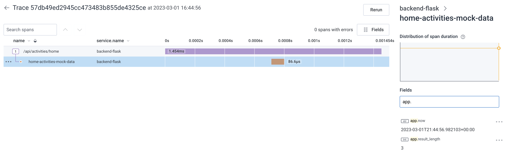
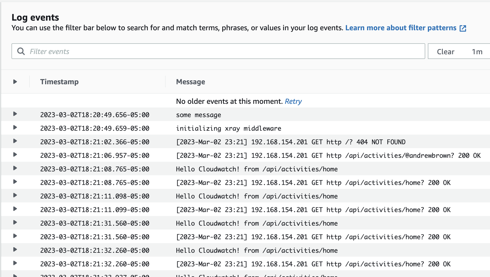
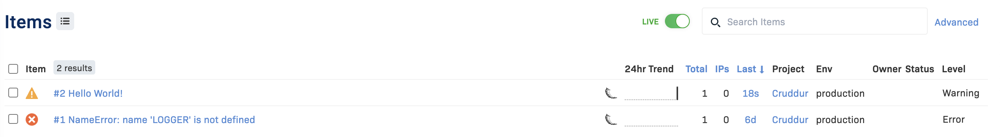
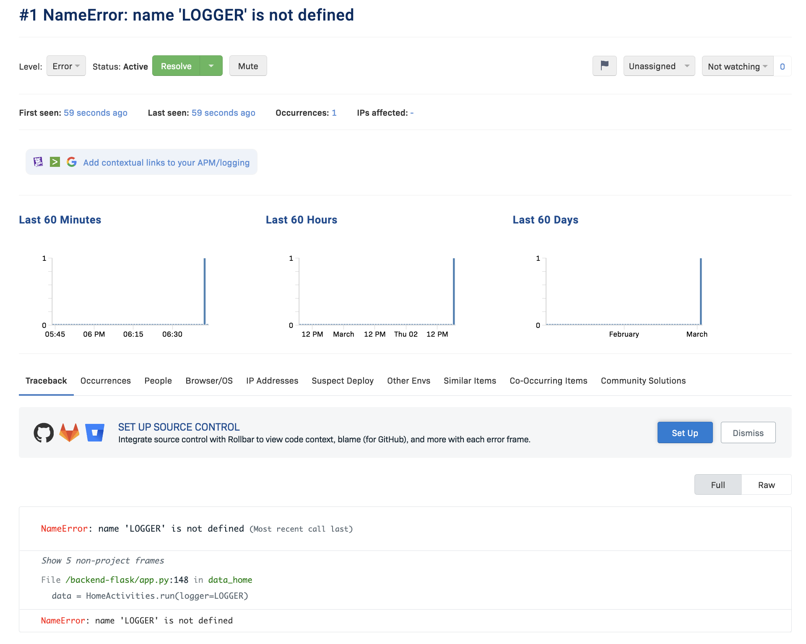

# Week 2 — Distributed Tracing

## Required Tasks

### Videos

I watched the following videos to prepare myself for week 2 of the cloud project bootcamp -

1. Week 2 live stream 
2. Spend Considerations for week 1 by Chirag
3. Observability Security Considerations by Ashish
4. Instrument Honeycomb with OTEL
5. Instrument AWS X-Ray with Subsegments
6. Configure and Instrument AWS CloudWatch with custom logger
7. Integrating Rollbar and capturing error

---

### Integrating Honeycomb with OTEL in backend flask application

- I added and installed the required packages to requirements.txt
- Created new environment on Honeycome and retireved the API Key for Honeycomb


- Added the required environment variables for OETL and Honeycomb to docker-compose.yml


- Integrated the flask application to use Honeycomb with sub-segments to log by initializing tracing, exporter and automatic instrumentation


---

### Integrating AWS X-Ray in backend flask application

- I added and installed the required packages to requirements.txt
- Created new log group for X-Ray using AWS CLI 
```
aws xray create-group \
   --group-name "Cruddur" \
   --filter-expression "service(\"backend-flask\")"
```


- Created sampling-rule for backend-flask logs
```
aws xray create-sampling-rule --cli-input-json file://aws/json/xray.json
```


- Added X-Ray Daemon as a container to docker-compose.yml
- Added code to app.py and home activity service, to log API requests


---

### Integrating AWS CloudWatch in backend flask application, to log API requests in CloudWatch logs

- Install and Add watchtower to requirements.txt
- Configure Logger and add it to app.py
- Integrate logging to home activities service



---

### Integrating Rollbar to catch and report errors

- Created Rollbar account and created a new flask-app, and fetched the ACCESS TOKEN
- Added and installed required python packages
- Create test endpoint and generate error to log to Rollbar





