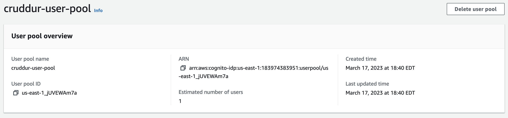
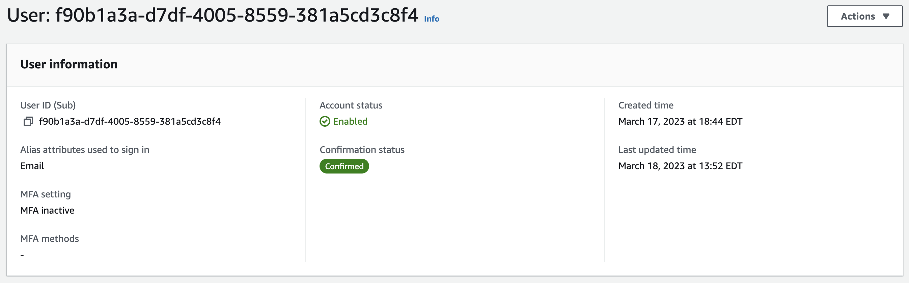
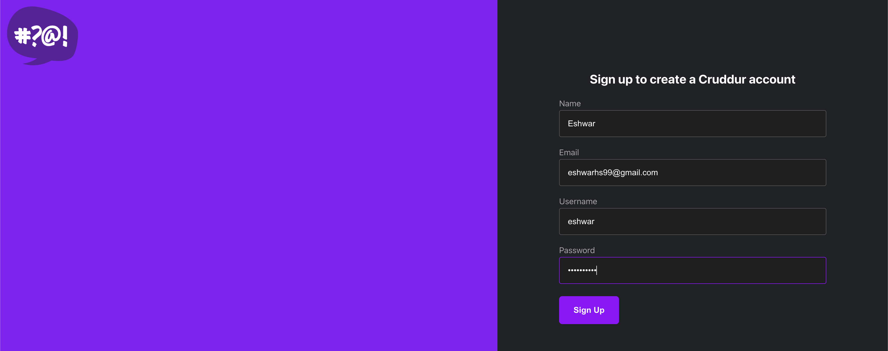
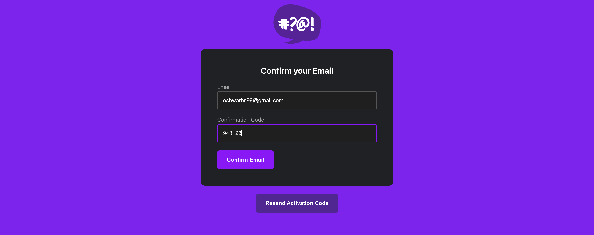
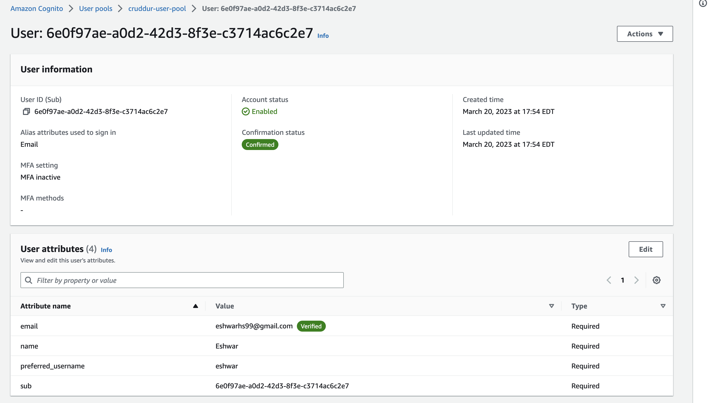
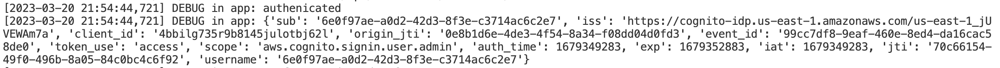
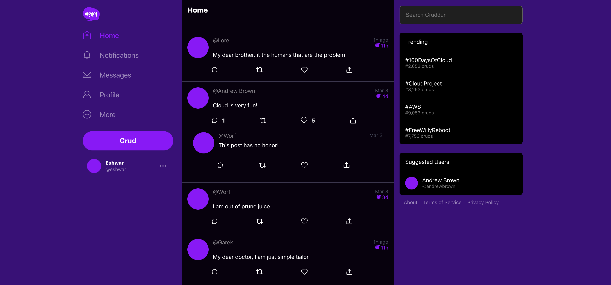

# Week 3 — Decentralized Authentication

## Required Tasks

### Videos

I watched the following videos to prepare myself for week 3 of the cloud project bootcamp -

1. Week 3 live stream
2. Amazon Cognito Security Best Practices by Ashish
3. Cognito JWT server side verification and more about JWT
4. Improving UI contrast

---

### Creating and setting up AWS Cognito

- I created new user pool on AWS using AWS Console

- Created user manually on AWS console and verified the user using AWS CLI command

- Updated the Sign Up, Sign In pages to create/login user with Cognito authentication

---

### Verify JWT token server side

- Updated flask app to verify JWT token of logged in user and conditionally show content

---
