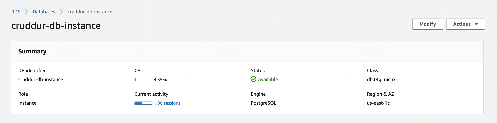
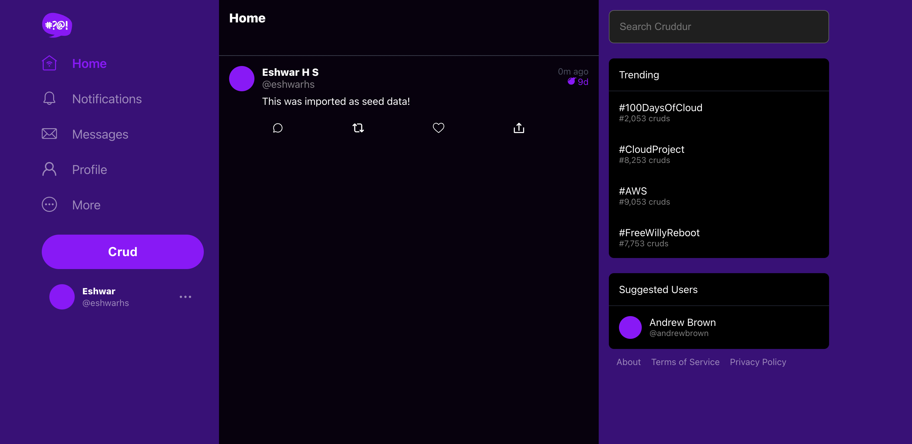
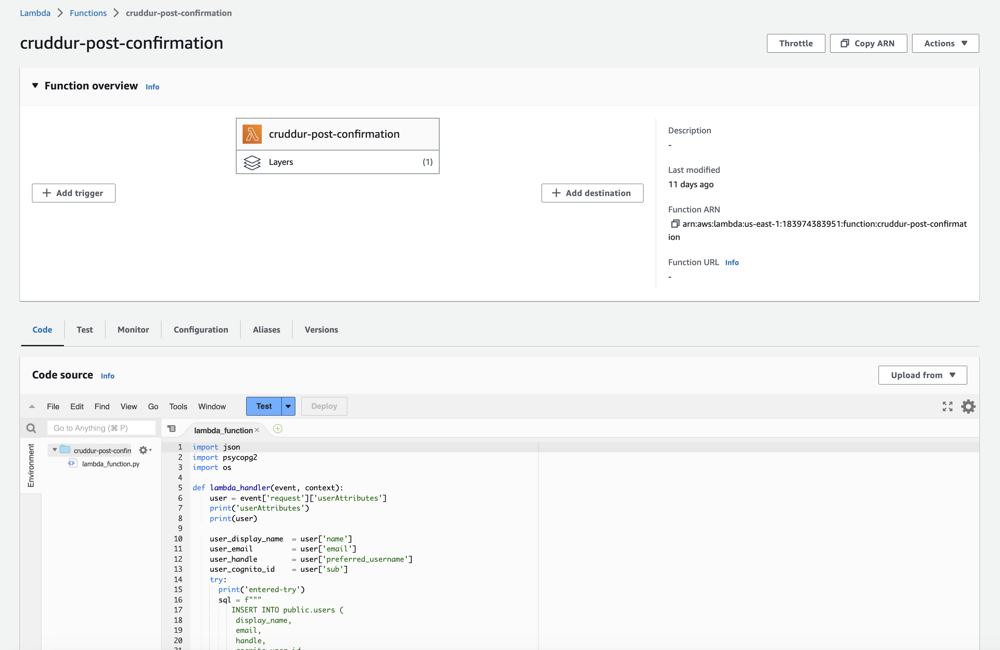
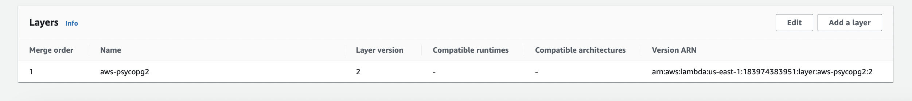
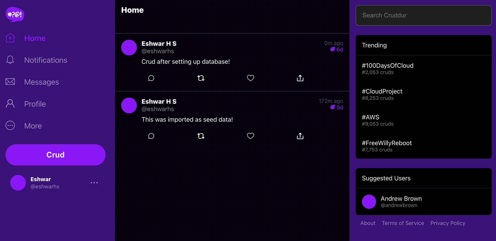

# Week 4 — Postgres and RDS

## Required Tasks

### Videos

I watched the following videos to prepare myself for week 3 of the cloud project bootcamp -

1. Week 4 live stream
2. Securing Amazon RDS Postgres Database by Ashish
3. Creating RDS Posgres instance and schema
4. Bash Scripting for common database actions -  connect, schema-load, seed, etc.
5. Installing Posgres Driver in backend app and connecting GitPod to RDS instance.
6. Creating PostConfirmation Lambda to add user to db after confirmation.
7. Creating new CRUDs and inserting to DB.

---

### Creating and setting up RDS Postgres instance

- Created an AWS RDS Posgres instance through AWS CLI using the following command - 


```bash
aws rds create-db-instance \
  --db-instance-identifier cruddur-db-instance \
  --db-instance-class db.t4g.micro \
  --engine postgres \
  --engine-version  14.6 \
  --master-username <username> \
  --master-user-password <password>\
  --allocated-storage 20 \
  --availability-zone us-east-1a \
  --backup-retention-period 0 \
  --port 5432 \
  --no-multi-az \
  --db-name cruddur \
  --storage-type gp2 \
  --publicly-accessible \
  --storage-encrypted \
  --enable-performance-insights \
  --performance-insights-retention-period 7 \
  --no-deletion-protection
```
  


---

### Trying PSQL locally

- Spin up the container with the local postgres db using `docker compose up`.
- Try connecting to PSQL with the password `password`.

```bash
psql -U postgres --host localhost
```

- Create cruddur db on postgres container using - 

```sql
CREATE database cruddur;
```

- Install uuid extension in the database and add the line to `schema.sql` - 

```bash
CREATE EXTENSION IF NOT EXISTS "uuid-ossp";
```

- Export connection urls for both local and prod databases, as environment variables
- Create bash scripts to perform various operation on the databse:
  - `db-create` : To create the database
  - `db-drop` : To drop the database
  - `db-schema-load` : To create the tables and add the extension
  - `db-connect` : To connect to either databases from GitPod
  - `db-seed` : To load dummy data in to the database for testing purpose
  - `db-sessions` : To view all open sessions 
  - `db-setup` : Master bash file to execute `db-drop`,`db-create`, `db-schema-load` and `db-seed` at once

- Once the local database is setup and seeded with values, it will look like this - 

```bash
cruddur=# \x auto
Expanded display is on.
cruddur=# SELECT * FROM activities;
-[ RECORD 1 ]----------+-------------------------------------
uuid                   | ccee1d7f-6a94-40a2-90c4-66f1b1b94c99
user_uuid              | 835aa96b-1d89-4391-ba02-3d5dd57ec9d2
message                | This was imported as seed data!
replies_count          | 0
reposts_count          | 0
likes_count            | 0
reply_to_activity_uuid | 
expires_at             | 2023-03-24 16:34:56.185924
created_at             | 2023-03-14 16:34:56.185924
```

---

### Install PSQL driver and creating library to access database from backend app

- Added the following to `requirments.txt`

```
psycopg[binary]
psycopg[pool]
```

- Created a file `db.py` inside `/lib`
- Update `docker-compose.yaml` to set CONNECTION_URL under backend-flask
- Update `home-activites.py` to include the db library and return results from db instead of hard-coded JSON results.
- Spin up the cotainers, run `db-setup` and refresh the Frontend URL to see the data from database



--- 

### Connecting to RDS

- Update the inbound security group for RDS to allow GitPod's IP address. 

```bash

GITPOD_IP=$(curl -s ifconfig.me)
```
- In the inbound rules, select "PostgreSQL" as the type and set your `<IP>/32` as the source. Provide a description.
- Try to connect to the database using the endpoint. Make sure that the `PROD_CONNECTION_URL` is correct:
- Create `rds-update-sg-rule`inside the `/backend/bin` folder, to automate updation of RDS security group to allow GitPod's IP address.
- Update `.gitpod.yml` postgres init to automatically run the sg-rule update bash script.

Output - 

```bash
❯ ./backend-flask/bin/db-connect prod
running in production
psql (13.10 (Ubuntu 13.10-1.pgdg22.04+1), server 14.6)
WARNING: psql major version 13, server major version 14.
         Some psql features might not work.
SSL connection (protocol: TLSv1.2, cipher: ECDHE-RSA-AES256-GCM-SHA384, bits: 256, compression: off)
Type "help" for help.

cruddur=>
```

### Load schema to RDS

- In docker-compose, change the connection URL to the `PROD_CONNECTION_URL`
- Run `db-schema-load` in prod:

```bash
❯ ./backend-flask/bin/db-schema-load prod
== db-schema-load
db-schema-load
running in production
CREATE EXTENSION
NOTICE:  table "users" does not exist, skipping
DROP TABLE
NOTICE:  table "activities" does not exist, skipping
DROP TABLE
CREATE TABLE
CREATE TABLE
```
---

### Creating Lambda Function

- Create `cruddur-post-confirmation.py` with the code provided.
- Set the `CONNECTION_URL` environment variable in the configuration
- To create and add the `psycopg2`layer to the lambda




---

### Cognito Lambda Trigger

- Set `Trigger type` to `Sign-up` for Cognito User pool. Set the `Sign-up` trigger to `Post confirmation`. Assign Lambda function that was just created.

---

### Home and Activity Post Endpoint Update

- Update `create_activity.py` to process the response and add the data to database. Create a `db.py` to add the record to db.
- Update `api/activities` route user_handle name to the auth username.
- Try posting a new crud.


